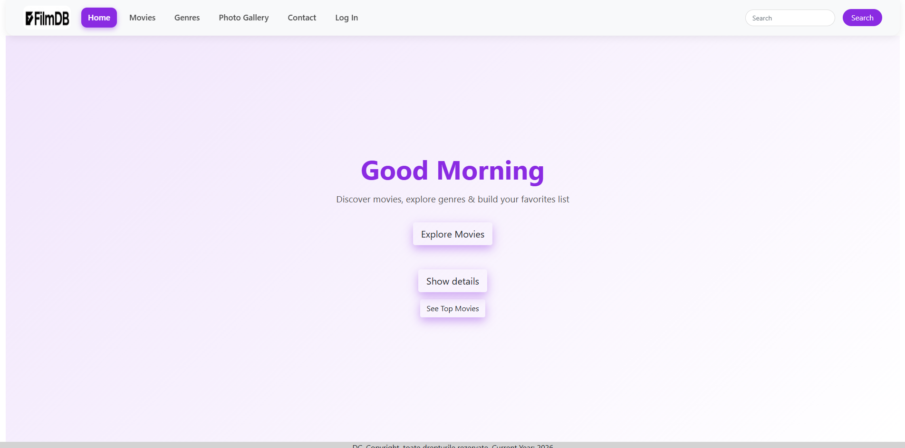
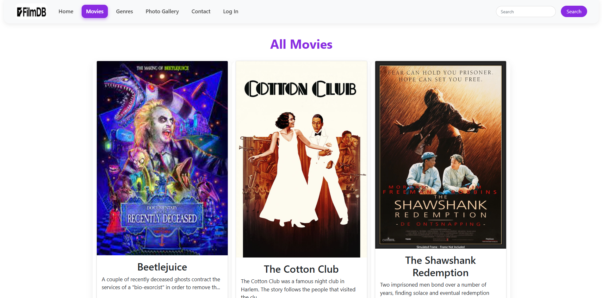
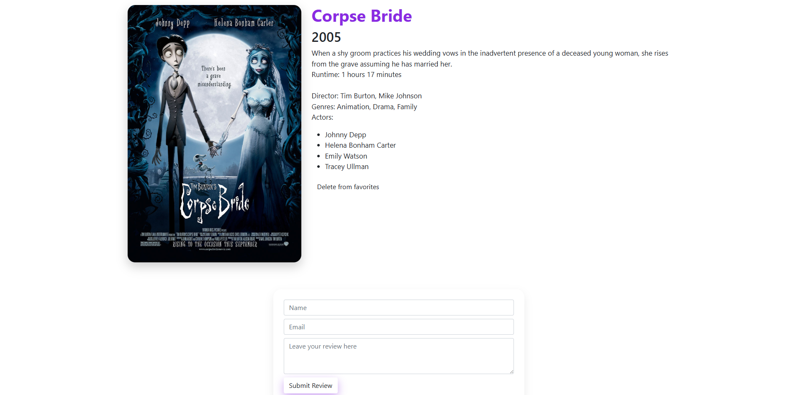
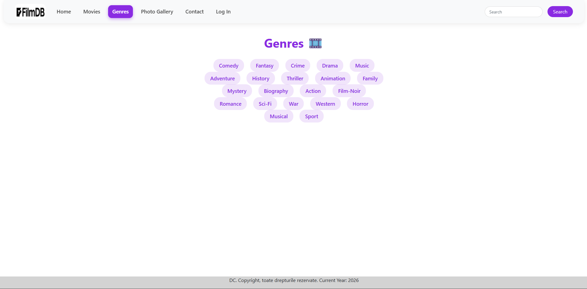
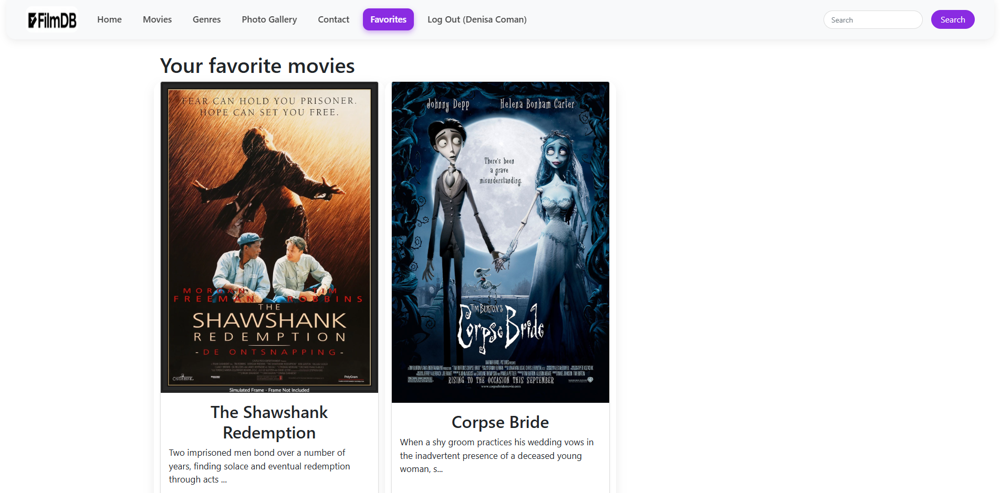
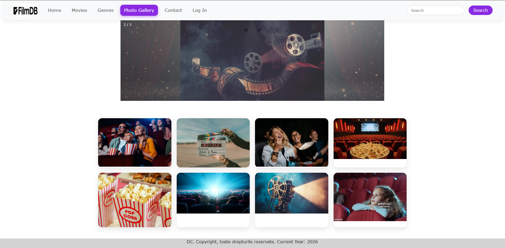
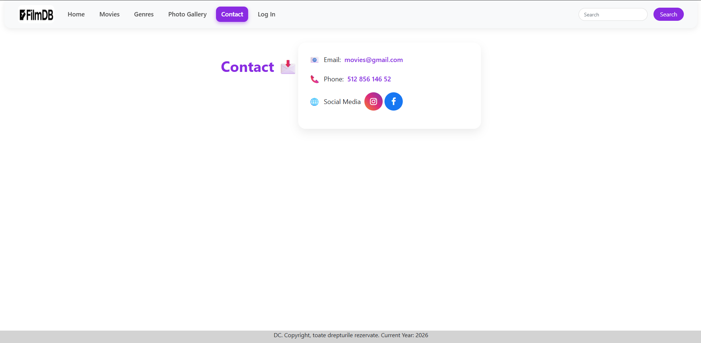
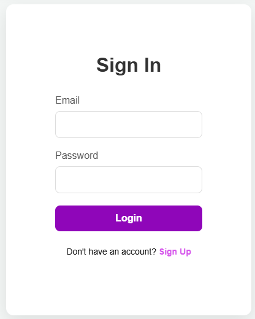
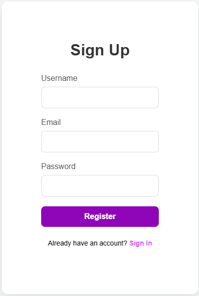

Movie Library Web Application (PHP & MySQL)
A full-stack web application built from scratch for browsing movies, user authentication, and managing a personal favorites list. The project focuses on dynamic content rendering, session management, and database interaction.
Features
  -	User authentication system (register, login, logout)
  -	Add and remove movies from favorites
  -	Movie categories by genres
  -	Search functionality
  -	Dynamic movie pages
  -	Photo gallery section
  -	Responsive UI with custom styling
  -	Structured architecture using reusable includes
Project Structure
/assets         → static resources
/img            → images used in the website
/includes       → reusable components (header, footer, database connection)

/auth           → authentication logic
/auth-style.css → authentication page styling

/index.php      → homepage
/movies.php     → movies listing
/movie.php      → single movie page
/genres.php     → movies by genre
/favorites.php  → user favorites page
/search-results.php → search functionality
/photo-gallery.php  → gallery page
/contact.php    → contact page
/logout.php     → session termination

/style.css      → main stylesheet

Technologies Used
  -	PHP
  -	MySQL
  -	HTML5 & CSS3
  -	Bootstrap
  -	JavaScript
  -	WAMP (Apache server)
Database
The database structure required for this project is available in:
/database/movie_library.sql
Setup
1.	Open phpMyAdmin
2.	Create a new database
3.	Import the SQL file from the /database folder
4.	Update the database credentials in the connection file from /includes

Screenshots
Home Page

Movies Page

Movie Details

Genres Page

Favorites Page

Photo Gallery

Contact Page

Sign In

Sign Up

Setup Instructions
1.	Clone/download the repository
2.	Import the MySQL database
3.	Configure database credentials in the connection file from /includes
4.	Run the project on localhost using XAMPP/WAMP

